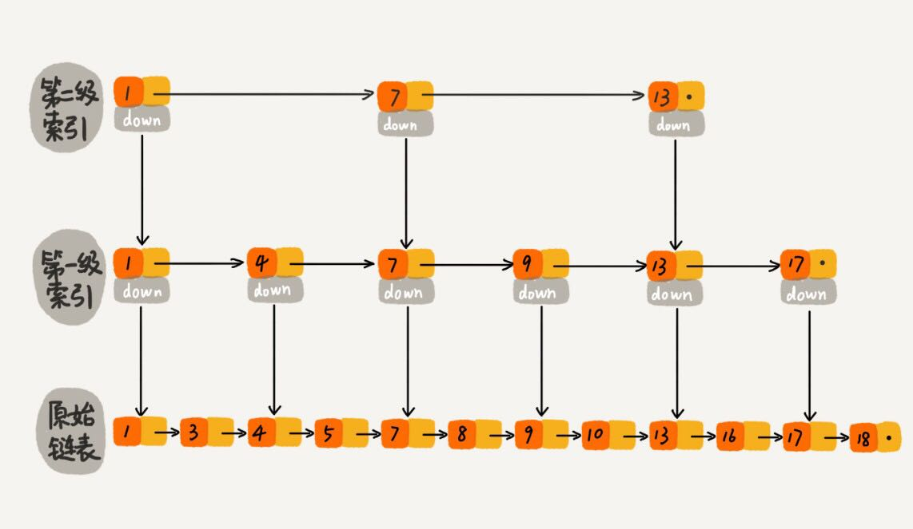

### 跳表

跳表的来源，为什么要使用跳表？  

对于一个集合，怎样才能更快的找到某个值，毫无疑问，使用二分查找是最有效的方式，但是二分查找是利用数组的快速检索的特点来实现的，那么对于链表怎么实现二分查找那，这就是跳表的来源，通过使用跳表来实现对链表进行二分查找，可以大大提高链表的查找速度。

下面是跳表的示意图



下面是跳表的查找过程


通过图片可以看出，利用跳表来查找链表上的数据是非常高效的，时间复杂度为O(logn)。

#### 跳表 - 链表添加多级索引

跳表是通过给链表添加索引实现快速检索，那这个索引的结构是怎么样的那？

通过上面的跳表示意图可以看出索引节点的结构大体是什么：

首先会有一个存储数据的字段，然后要有指明本层中下一个索引节点的指针，还需要有字段指明下一层中的索引节点位置。建立索引节点首先要明白是按照层数建立的，最终形成的结构跟树的结构类似。

所以我们可以使用下面的结构来表示一个索引节点：

```javascript
class SLNode{
  data = null; //该节点存储的数据
  level = 0; //该节点所在的层数
  nodes = new Array(); //该数组存储与他相关联的索引节点（同层下一个节点和同列下index层的节点），用数组的索引值（index）来表明是那一层的节点，如果index == level，则表明该节点是同层的下一个节点（相当于下一个兄弟节点）
}
```

#### 跳表的基本操作

- 初始化

初始化该跳表
```javascript
let maxLevel = 16; //最大层数
class SkipList{
  levelCount = 1; //表明该跳表一共有多少层
  head = new SLNode(); //该跳表的开始节点
}
```

- 插入

跳表插入数据，如果不更新索引的话，在两个索引之间会有很多个节点，在极端情况下会退化成单链表。所以为了保持跳表的持续性能，我们需要动态的更新索引，但是索引的更新会涉及到添加在那一层的问题，所以这个可以通过一个随机函数来生成该节点索引所在的层数。

```javascript
//先定义好该随机函数
randLevel(){
  let level = 1;
	for(let i = 1; i < maxLevel; i++) {
	  if(Math.random() < 0.5) {
		  level++;
	  }
	}
	return level;
}

insert(value){
  let level = randLevel();
  let newNode = new SLNode();
  newNode.level = level;
  newNode.data = value;
  let tempNodes = new Array(level).fill(new SLNode());
  let p = this.head;
  //该循环是找到新节点要放在那个节点的右面既要找到该节点要放在那个地方
  //标记1
  for(let i = level - 1; i >= 0; i--){
    while(p.nodes[i] !== undefined && p.nodes[i].data < value){
      p = p.nodes[i];
    }
    tempNodes[i] = p;
  }
  //跟链表的插入类似，不过这里要把level层以下的node的指向全部改掉
  //标记2
  for(let i = level - 1; i >= 0; i--){
    newNode.nodes[i] = tempNodes[i].nodes[i];
    tempNodes[i] = newNode;
  }

  //如果随机生成的level比当前maxLevel大，则更新maxLevel
  if(this.levelCount < level){
    this.levelCount = level;
  }
}
```

跳表的插入操作大体上就是，找到新插入的节点应该插入的位置，将新节点的指针改到原节点的下一个节点，然后改变原节点的指针指向新节点，就是代码中‘标记2’的位置。在找新节点的插入位置的时候（‘标记1’）有两层循环，外面一层循环是改变层数，从新节点的最高层（也就是level的值）往下遍历，每遍历一层，都会进入该层，查找当前层中当前节点的下一个节点比新节点的值的大的，如果找到了，则将当前节点的地址赋值给一个临时的变量中，在这里就是tempNodes[i]（在这里有个技巧是，tempNodes[0],tempNodes[1],tempNodes[2],...分别存放原始层，第一层，第二层的临时变量）,找到存放的位置，剩下的就是插入了。也就是标记2的操作。

- 查找

如果插入明白了，那查找就简单了，看下面的代码

```javascript
find(value){
  if(!value) return null;
  let p = this.head;
  for(let i = this.leve - 1; i >= 0; i--){
    while(p.nodes[i] != undefined && p.nodes[i].data < value){
      p = p.nodes[i];
    }
  }

  if(p.nodes[0] !== undefined && p.nodes[0] == value){
    return p.nodes[0];
  }
  return null;
}
```

查找的过程就是从最顶层开始找，进入每层里面找到当前节点的下一节点的值比value大的，然后返回当前节点，直到遍历到最底层，也就是原始层，查看下一节点的值是否等于要查找的值，等于则返回，否则返回null。这里与插入最大的区别是只需要维护一个节点就可以，插入则需要维护level个节点。

- 删除

删除和插入很像，基本思路就是通过for加while循环，找到要删除的节点，然后将该删除节点的上一个节点指向该删除节点的下一个节点，这里也需要更改node.level个指针（说明：在删除节点的时候for循环使用this.levelCount而不是_node.level,是为了与update的节点中的索引一一对应起来）

```javascript
remove(value) {
	let _node;
	let p = this.head;
	const update = new Array(new Node());
	for(let i = this.levelCount - 1; i >= 0; i--) {
	  while(p.nodes[i] !== undefined && p.nodes[i].data < value){
		  p = p.nodes[i];
	  }
	  update[i] = p;
	}

	if(p.nodes[0] !== undefined && p.nodes[0].data === value) {
	  _node = p.nodes[0];
	  for(let i = 0; i <= this.levelCount - 1; i++) {
      if(update[i].nodes[i] !== undefined && update[i].nodes[i].data === value) {
        update[i].nodes[i] = update[i].nodes[i].nodes[i];
      }
	  }
	  return _node;
	}
	return null;
}
```

跳表的查找和数组的二分查找一样，时间复杂度为O(logn),性能非常高，空间复杂度为O(n)，插入操作因为要先找到插入的节点所以时间复杂度要比单链表O(1)的时间复杂高,为O(logn)。删除的时间复杂和插入类似要先找到删除的节点，然后删除原始节点和该节点上所对应的索引（如果有的话），时间复杂度也为O(logn)。
