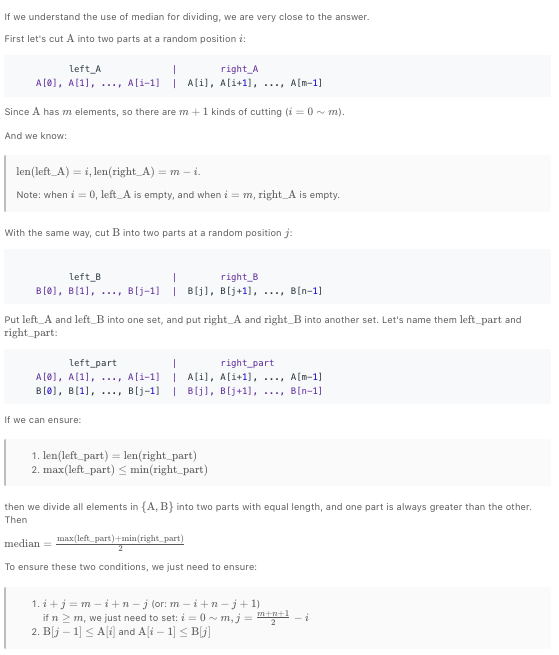

### Median of Two Sorted Arrays

问题描述: 从两个排好序的数组中查找中位数

要求时间复杂度要在O(log(m + n))

example 1
```
nums1 = [1,2];
nums2 = [3,4];

median = (2 + 3) / 2
```

example 2
```
nums1 = [1,2];
nums2 = [4];

median = 2
```

example 3
```
nums1 = [1];
nums2 = [-2, -1];

median = -1
```

> 方法1: 
  答题思路是将两个数组进行组装成一个排好序的数组，然后通过去中间值来获取中位数，但是这样的复杂度是O(m + n); 虽然思路很简单，但是时间复杂度太高。

> 方法2: 
  该方法的思想有点二分搜索的思想，想取得两个排好序数组的中位数，那将两个数组分别分为左边left和右边right，条件始终满足len(A_left) + len(B_left) == len(A_right) + len(B_right)的情况下，去移动i和j，i和j分别标志A，B两个数组的左边右边分界点，并且i和j只要满足一下情况说明正确找到了两个数组的中位数:  
  A[i-1] <= B[j] && B[j-1] <= A[i]; 
  整体思路如下图所示:

   