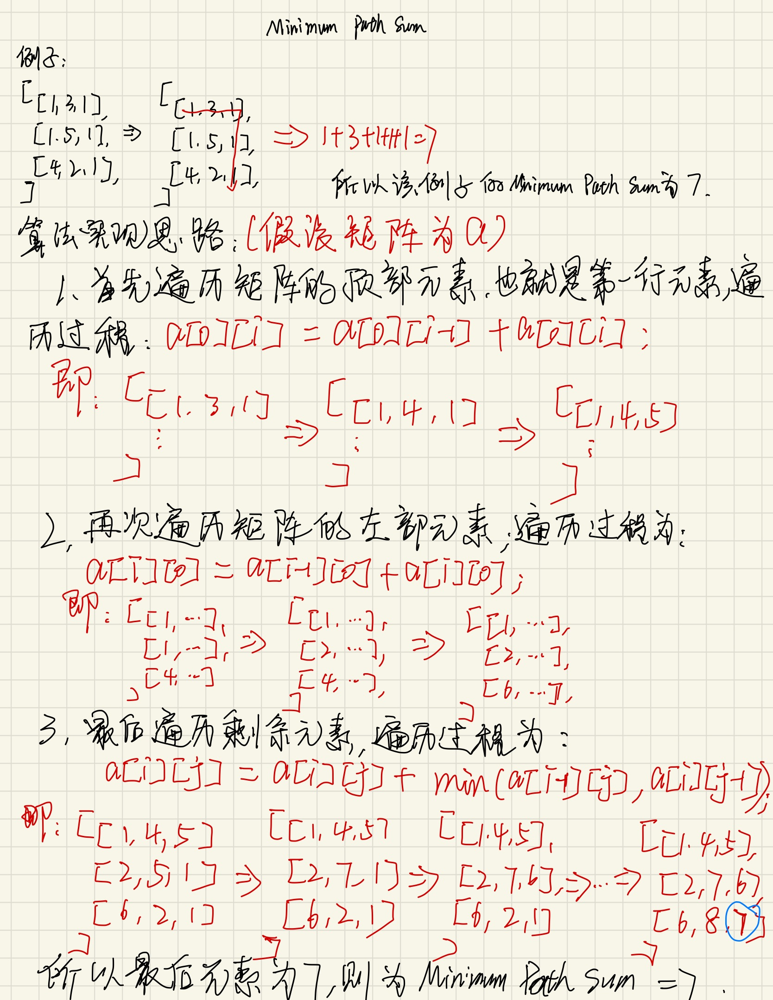

## Minimum Path Sum

给定一个m * n的矩阵，找到一条从左上到右下的一条路经。该路径的总和值为最小值。

> note
> 移动只能往下或者是右移动。

#### example
```
Input:
[
  [1,3,1],
  [1,5,1],
  [4,2,1]
]
Output: 7
Explanation: Because the path 1→3→1→1→1 minimizes the sum.
```

具体思路如下:

