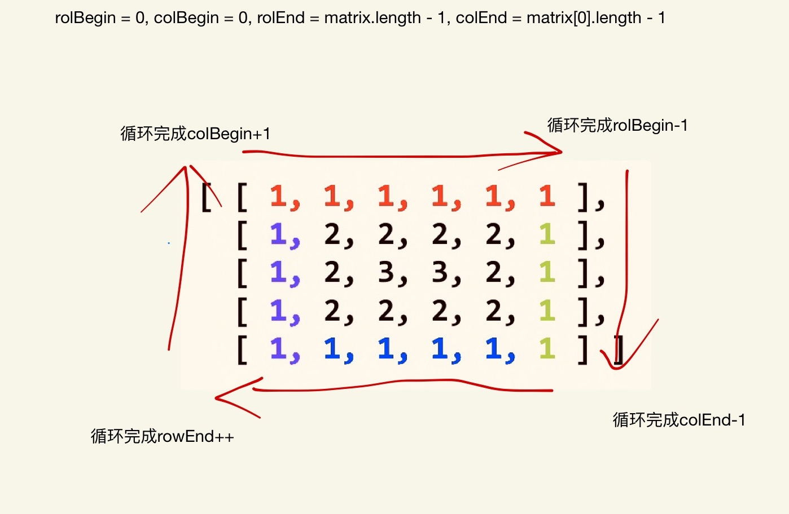

### spiral order 螺型顺序
 
  给定一个m * n的二维数组（m行，n列），返回该数组的螺型顺序
 
```
    Input:
      [
        [ 1, 2, 3 ],
        [ 4, 5, 6 ],
        [ 7, 8, 9 ]
      ]
    Output: [1,2,3,6,9,8,7,4,5]
    Input:
    [
      [1, 2, 3, 4],
      [5, 6, 7, 8],
      [9,10,11,12]
    ]
    Output: [1,2,3,4,8,12,11,10,9,5,6,7]
```

解题思路: 先循环遍历top元素，top元素循环完毕后相对应的rowBegin++（保证下次循环的时候循环第二行），然后遍历right元素，循环完毕后colEnd--（保证下次循环后遍历的是倒数第二列），然后遍历bottom元素，循环完毕后rowEnd--（保证下次循环后遍历的是倒数第二行），最后循环遍历left元素，循环完毕后colBegin++（保证下次循环的是第二列）。这是一次顺时针循环遍历，下次遍历根据rowBegin，colEnd，rowEnd，colBegin再次顺时针遍历，知道rowBegin > rowEnd && colBegin > colEnd,结束循环，输出结果。



[代码](./Spiral_Order.js)