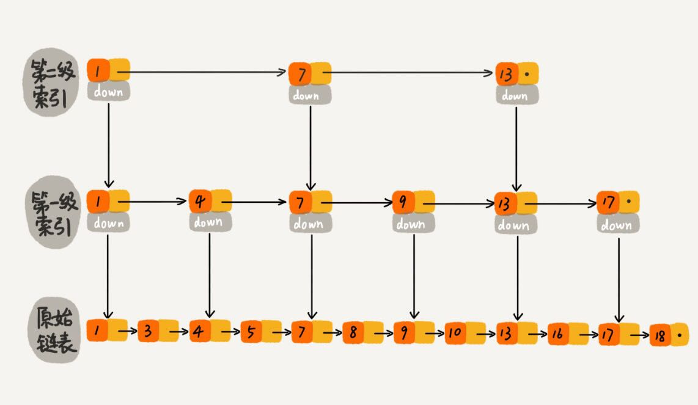
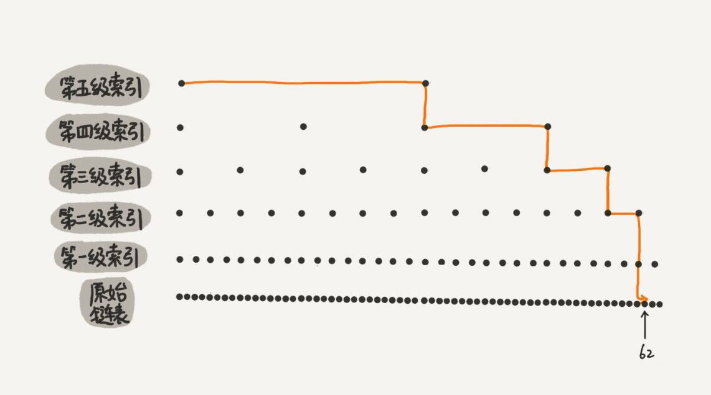

### 跳表

跳表的来源，为什么要使用跳表？  

对于一个集合，怎样才能更快的找到某个值，毫无疑问，使用二分查找是最有效的方式，但是二分查找是利用数组的快速检索的特点来实现的，那么对于链表怎么实现二分查找那，这就是跳表的来源，通过使用跳表来实现对链表进行二分查找，可以大大提高链表的查找速度。

下面是跳表的示意图

下面是跳表的查找过程

通过图片可以看出，利用跳表来查找链表上的数据是非常高效的，时间复杂度为O(logn)。

#### 跳表 - 链表添加多级索引

跳表是通过给链表添加索引实现快速检索，那这个索引的结构是怎么样的那？

通过上面的跳表示意图可以看出索引的结构大体是什么：

首先会有一个存储数据的字段，然后要有指明本层中下一个索引的指针，还需要有字段指明下一层中的索引位置。

