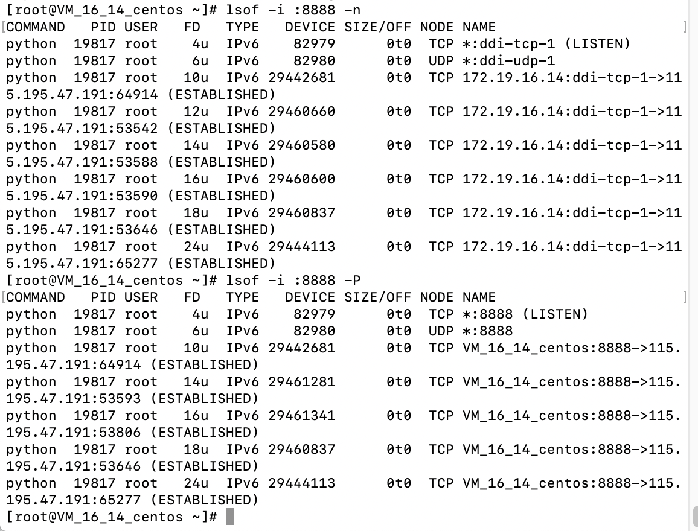

### lsof

(官方介绍)[https://linux.die.net/man/8/lsof]

查看linux/nuix那些文件被打开，可以使用改命令，由于在类unix系统中所有的东西都是文件，所以该命令可以查看常规文件，目录，库，块特殊文件，字符特殊文件，执行文本引用，甚至是流或网络文件等等。

#### 常用命令

1. ```lsof```  
列出系统所有的进程打开文件
2. ```lsof -u [userName]```  
列出某个用户下进程打开的文件
3. ```lsof -i [4/6/:port/协议/@ip]```  
列出基于网络地址的文件（4:IPV4,6:IPV6,协议:tcp/udp/http/...）
4. ```lsof -p [PID]```  
根据PID列出相应opened files
5. ```lsof -t [fileName]```  
list IDs of processes that have opened a particular file
6. ```lsof +D [directory-path]```  
search for all open instances of a directory(including all files and direcotry it contains)
7. ```lsof -f :[port/port rang(1-2014)]```  
列出基于特定端口或者是某些端口 opened files
8. ```lsof -N [目录]```
列出使用NFS的文件
9. ```lsof -p [PID] -R```  
forces to list the Parent Process IDentification(PPID) about the PID in the output.
10. ```lsof -n```
no host names
11. ```lsof -P```
no port names
12. ```lsof -i :8888 -r 3```
指定每隔三秒输出一次在使用8888端口的文件



#### lsof输出各列信息的含义

- COMMAND：进程的名称

- PID：进程标识符

- PPID：父进程标识符（需要指定-R参数）

- USER：进程所有者

- PGID：进程所属组

- FD：文件描述符，应用程序通过文件描述符识别该文件。如cwd、txt等:

```
（1）cwd：表示current work dirctory，即：应用程序的当前工作目录，这是该应用程序启动的目录，除非它本身对这个目录进行更改
（2）txt ：该类型的文件是程序代码，如应用程序二进制文件本身或共享库，如上列表中显示的 /sbin/init 程序
（3）lnn：library references (AIX);
（4）er：FD information error (see NAME column);
（5）jld：jail directory (FreeBSD);
（6）ltx：shared library text (code and data);
（7）mxx ：hex memory-mapped type number xx.
（8）m86：DOS Merge mapped file;
（9）mem：memory-mapped file;
（10）mmap：memory-mapped device;
（11）pd：parent directory;
（12）rtd：root directory;
（13）tr：kernel trace file (OpenBSD);
（14）v86  VP/ix mapped file;
（15）0：表示标准输入
（16）1：表示标准输出
（17）2：表示标准错误
一般在标准输出、标准错误、标准输入后还跟着文件状态模式：r、w、u等
（1）u：表示该文件被打开并处于读取/写入模式
（2）r：表示该文件被打开并处于只读模式
（3）w：表示该文件被打开并处于
（4）空格：表示该文件的状态模式为unknow，且没有锁定
（5）-：表示该文件的状态模式为unknow，且被锁定
同时在文件状态模式后面，还跟着相关的锁
（1）N：for a Solaris NFS lock of unknown type;
（2）r：for read lock on part of the file;
（3）R：for a read lock on the entire file;
（4）w：for a write lock on part of the file;（文件的部分写锁）
（5）W：for a write lock on the entire file;（整个文件的写锁）
（6）u：for a read and write lock of any length;
（7）U：for a lock of unknown type;
（8）x：for an SCO OpenServer Xenix lock on part      of the file;
（9）X：for an SCO OpenServer Xenix lock on the      entire file;
（10）space：if there is no lock.
```
- TYPE：文件类型，如DIR、REG等，常见的文件类型:

```
（1）DIR：表示目录
（2）CHR：表示字符类型
（3）BLK：块设备类型
（4）UNIX： UNIX 域套接字
（5）FIFO：先进先出 (FIFO) 队列
（6）IPv4：网际协议 (IP) 套接字
```
- DEVICE：指定磁盘的名称

- SIZE：文件的大小

- NODE：索引节点（文件在磁盘上的标识）

- NAME：打开文件的确切名称