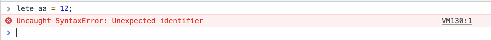

### js的执行过程

js在浏览器中的执行的过程分为一下三个阶段:  

1. 语法分析阶段
2. 预编译阶段
3. 执行阶段

#### 语法分析阶段

语法分析是浏览器在加载完成js代码的时候，按照js的预定的语法规则进行代码的语法检查，词法检查等，如果发现语法错误，则抛出SyntaxError错误(如下图)，后面两个阶段就不执行了，如果没有错误，则进入预编译阶段。

#### 预编译阶段

预编译阶段的主要任务是创建代码执行的各种环境(即执行上下文)。  
环境主要包括: 

1. 全局环境(代码加载完毕，进入预编译阶段，首先创建的就是全剧环境)
2. 函数环境()
3. eval环境

