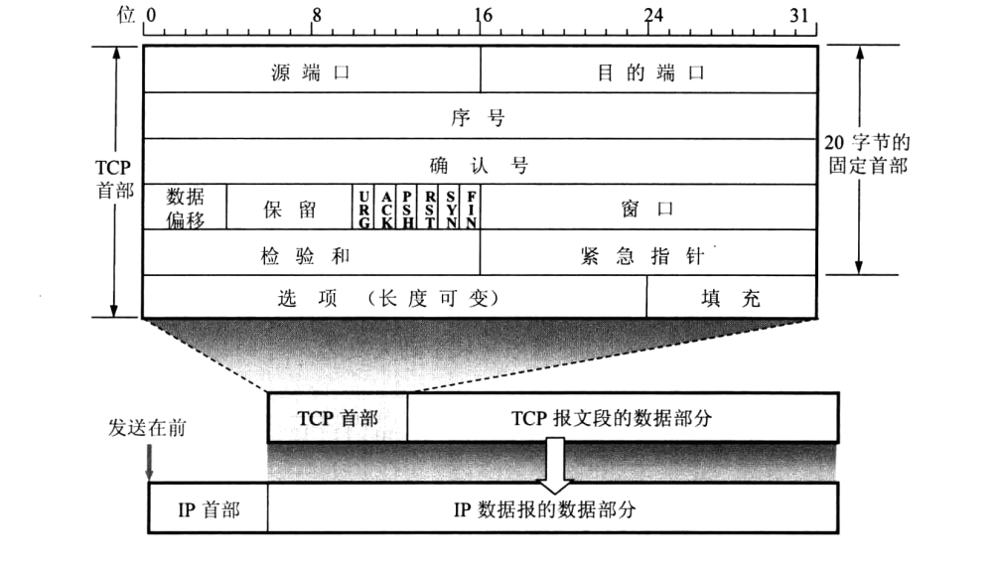
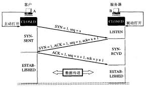
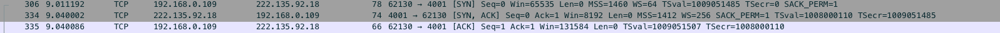
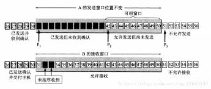
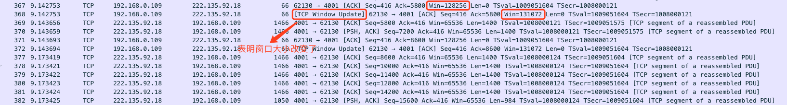
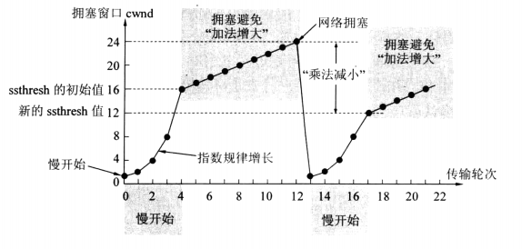
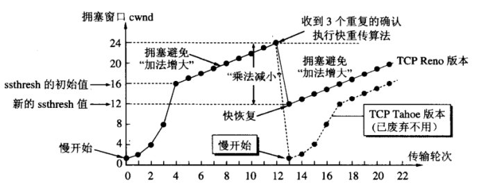

# 计算机网络 - TCP(Transmission Control Protocol)

TCP是计算机网络中五层协议中的传输层，介于网络层和应用层之间(其他四层分别是物理层，数据链路层，网络层和应用层)。

## TCP的主要特点

1. TCP是面向连接的运输层协议。
2. 每一TCP连接只能有两个端点。
3. TCP提供可靠交付的服务。
4. TCP提供全双工通信。
5. 面向字节流。

## TCP报文段的首部格式

## TCP的连接

TCP连接的端点是个很抽象的套接字，即IP地址:端口号，例如: 127.0.0.1:8080, 同一个IP地址可以有多个不同的TCP连接，同一个端口号也可以出现在多个不同的TCP连接中。

- #### TCP的连接管理 - 3次握手
  
  TCP三次握手示意图:  
  

  A是客户端，B是服务端，最初两端的TCP进程都处于CLOSE状态，连接建立开始是A主动发起连接，B被动打开连接。  

  1. 首先，客户端A向服务端B发送连接请求报文段，这时TCP首部的同步位SYN = 1，同时选择一个初始序号 seq = x。TCP规定，SYN = 1的报文段不能携带数据，但是要消耗掉一个序号，这时，TCP客户端进入SYN-SENT状态。  
  2. 服务端B收到连接请求报文段后，如果同意连接，则向客户端A发送确认。再确认报文段中把SYN和ACK都置为 1，同时为自己选择一个初始序号seq = y，并且将报文段中的确认号ack = x + 1。并且这个报文段也不能携带数据。这时服务端B进程处于SYN-RCVD状态。  
  3. 客户端A收到服务端B发送过来的确认请求后，还要在向服务端B再次发送确认。确认报文段中的ACK = 1，确认号ack = y + 1,而自己的序号seq = x + 1，而此时客户端A处于ESTABLISHED状态，服务端B收到该确认报文后也处于ESTABLISHED。  
  至此，TCP三次握手结束，正式进入连接状态。如下图:  
  
  

  注意: 为什么客户端A还要进行第三次握手确认？  
  这里主要防止已失效的连接请求突然又传送给服务端B，导致服务端B持续等待，浪费资源。

## TCP数据传送

TCP连接的可靠是指: 无差错，不丢失，不重复并且按序到达。

- ### TCP可靠传输的实现

  #### `滑动窗口`

    

  

  #### `超时重传`

  #### `校验和`

- ### TCP的流量控制

  流量控制是指: 让发送方的发送速率不要太快，要让接收方来得及接受。往往指点对点通信量的控制。

  #### `利用滑动窗口实现流量控制`

  刚开始的窗口大小是在TCP建立连接的时候协商的，到后面随着数据开始发送到服务端，或者是服务端发送数据到客户端，都会有一个win的字段指明自己所能接受的窗口大小，对方发送的窗口大小就不会超过该窗口大小(窗口大小的单位是字节而不是报文段),如下图:  

  

- ### TCP的拥塞控制

  拥塞控制: 防止过多的数据注入到网络中，这样可以使网络中的路由器或者链路不致过载。

  注意: 拥塞控制跟流量控制不同的地方是需要整个网络的信息的，而流量控制则是只需要对方的缓存信息。

  #### `慢开始和拥塞避免`

  发送方会维持一个拥塞窗口的状态变量。拥塞窗口的大小取决于网络的拥塞程度，并且是动态变化的，发送方让自己的发送窗口等于拥塞窗口。并且如果受到流量控制的话，发送窗口还可能小于拥塞窗口。  

  慢开始策略:  
  主机刚开始发送数据的时候，由于不知道当前的网络环境是怎样的，如果把大量的数据字节注入到网络中，很有可能引起网络阻塞。所以，慢开始的策略是，刚开始只是探探路，从小到大逐渐增大发送窗口，也就是说，从小到大逐渐增大拥塞窗口数值。一般刚开始先把拥塞窗口设置为一个最大报文段MSS的数值。每一次按时收到一个报文段的确认后，把拥塞窗口增加至多一个MSS的数值，也就是当前拥塞窗口数值的两倍，直到增加到一个阀值(慢开始门限ssthresh)。  

  拥塞避免策略:  
  当当前拥塞窗口到大慢开始门限阀值以后，每次按时收到确认报文都将当前的拥塞窗口 + 1，目的是为了让拥塞窗口缓慢的增大，而不是加倍的增大。  

  还有一个策略是: 不管当前处在慢开始阶段还是拥塞避免阶段，只要网络出现拥塞(发送方没有按时收到接收方的确认)，就要把慢开始门限设置为出现拥塞时的发送窗口值的一半，但是不能小于2。然后把拥塞窗口重新设置为1，重新执行慢开始和拥塞避免算法。 如下图:  

  
  
  #### `快重传和快恢复`

  快重传是针对失序报文段，由于TCP每次向发送端发送确认报文都是按序发的，也就是说如果发送的的确认报文的序号是101，那101之前的报文都已经按序到达了，所以如果接受端收到的报文序号是不连续的，那么TCP要等待那个缺失的报文段，直到缺失的报文段到达，才会移动窗口进行后面报文的接受，所以如果缺失的报文一直不来那么就会卡在哪里等待缺失报文，直到触发延时重传，所以就有了快重传策略。  

  快重传策略: 如果接收方接收到一个失序的报文段，就会立即发送一个ACK给发送方，而不是等待发送延时的ACK，就是立即告诉发送方，我现在立刻需要这个缺失的报文，并且是连续发送三次，警告发送方立刻给我回传这个缺失的报文段，发送方一连收到三个重复的确认报文，就知道接收方要我立即重传该报文段，所以会立马重新发送那个缺失的报文段，所以就不需要等待缺失报文的延时时钟的触发。  

  快恢复策略: 发送方一旦遇到超时重传或者快重传，就表明遇到网络拥塞情况了，按照慢开始策略会将慢开始门限ssthresh缩减为出现网络拥塞时窗口的一半，拥塞窗口会变为一个最大报文段的数值，但是快恢复是将拥塞窗口大小变为更新后的慢开始门限(有的版本是ssthresh+3)的大小。  

  如下图: 

    

## TCP断开连接

1. 等到数据传送完成，客户端会主动发送断开连接的请求，FIN=1的报文段发送给服务端，并且序号为seq=u(等于前面已经发送过来的最后一个字节的序号+1)，此时客户端进入FIN-WAIT-1(终止等待1)状态。TCP规定，FIN报文即使不携带数据也要消耗一个序号。  

2. 服务端收到连接释放报文，发出确认报文，ACK=1,ack=u+1,并且带上自己的序列号seq=v,此时服务进入CLOSE-WAIT(关闭等待状态)。  

3. 客户端收到服务端发送的确认报文后，此时客户端进入了FIN-WAIT-2(等待关闭2)状态,等待服务器发送连接释放报文。在这之前还要接受服务器发送的最后的数据。  

4. 服务器将最后的数据发送完毕以后，就向客户端发送连接释放报文，FIN=1，ack=u+1，由于处于半关闭状态，服务器很可能又发送了一些数据，假定此时的序列号为seq=w，此时服务器就进入了LAST-ACK(最后确认)状态，等待客户端的确认。  

5. 客户端收到服务端的连接释放报文后，必须发送确认，ACK=1，ack=w+1，而自己的序列号为seq=u+1，此时客户端进入了TIME——WAIT(时间等待)状态。注意此时TCP连接还没有释放，必须经过2*MSL(最长报文段寿命)的时间后，当客户端撤销相应的TCB后，进入CLOSED状态。  

6. 服务器只要收到了客户端发送的确认，立即进入CLOSED状态。同样，撤销TCB后，就结束了这次TCP的连接。可以看到，客户端结束TCP的时间要比服务端结束的时间要长。  

  如下图整个过程:  
  

  #### 说明

  * 为什么客户端要等待2MSL？  
    MSL（Maximum Segment Lifetime），TCP允许不同的实现可以设置不同的MSL值。

    第一，保证客户端发送的最后一个ACK报文能够到达服务器，因为这个ACK报文可能丢失，站在服务器的角度看来，我已经发送了FIN+ACK报文请求断开了，客户端还没有给我回应，应该是我发送的请求断开报文它没有收到，于是服务器又会重新发送一次，而客户端就能在这个2MSL时间段内收到这个重传的报文，接着给出回应报文，并且会重启2MSL计时器。

    第二，防止类似与“三次握手”中提到了的“已经失效的连接请求报文段”出现在本连接中。客户端发送完最后一个确认报文后，在这个2MSL时间中，就可以使本连接持续的时间内所产生的所有报文段都从网络中消失。这样新的连接中不会出现旧连接的请求报文。

  * 为什么建立连接是三次握手二释放连接是四次？  

    建立连接的时候， 服务器在LISTEN状态下，收到建立连接请求的SYN报文后，把ACK和SYN放在一个报文里发送给客户端。
    而关闭连接时，服务器收到对方的FIN报文时，仅仅表示对方不再发送数据了但是还能接收数据，而自己也未必全部数据都发送给对方了，所以己方可以立即关闭，也可以发送一些数据给对方后，再发送FIN报文给对方来表示同意现在关闭连接，因此，己方ACK和FIN一般都会分开发送，从而导致多了一次。

  * 如果已经建立连接了，客户端突然出现故障了怎么办?

    TCP还设有一个保活计时器，显然，客户端如果出现故障，服务器不能一直等下去，白白浪费资源。服务器每收到一次客户端的请求后都会重新复位这个计时器，时间通常是设置为2小时，若两小时还没有收到客户端的任何数据，服务器就会发送一个探测报文段，以后每隔75秒发送一次。若一连发送10个探测报文仍然没反应，服务器就认为客户端出了故障，接着就关闭连接。

