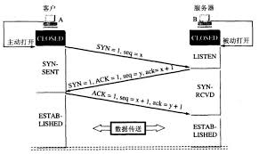
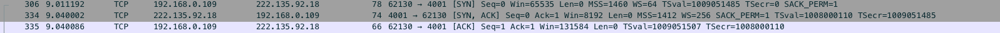
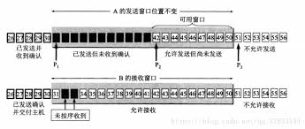
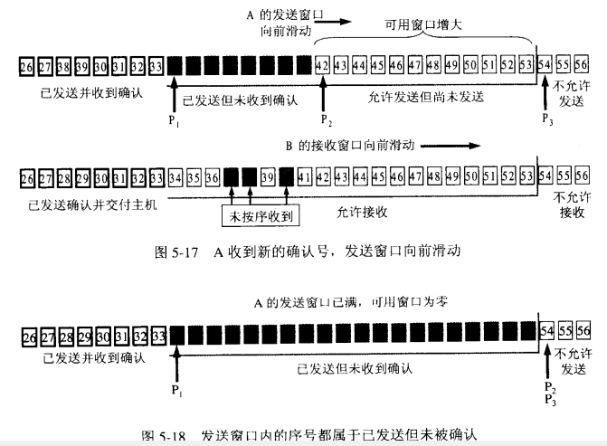
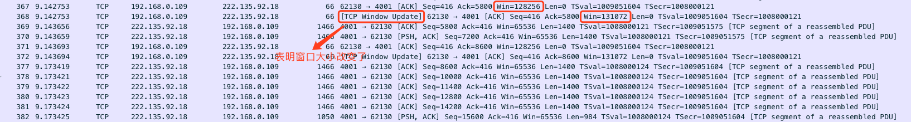

# 计算机网络 - TCP(Transmission Control Protocol)

TCP是计算机网络中五层协议中的传输层，介于网络层和应用层之间(其他四层分别是物理层，数据链路层，网络层和应用层)。

## TCP的主要特点

1. TCP是面向连接的运输层协议。
2. 每一TCP连接只能有两个端点。
3. TCP提供可靠交付的服务。
4. TCP提供全双工通信。
5. 面向字节流。

## TCP报文段的首部格式

## TCP的连接

TCP连接的端点是个很抽象的套接字，即IP地址:端口号，例如: 127.0.0.1:8080, 同一个IP地址可以有多个不同的TCP连接，同一个端口号也可以出现在多个不同的TCP连接中。

- #### TCP的连接管理 - 3次握手
  
  TCP三次握手示意图:  
  

  A是客户端，B是服务端，最初两端的TCP进程都处于CLOSE状态，连接建立开始是A主动发起连接，B被动打开连接。  

  首先，客户端A向服务端B发送连接请求报文段，这时TCP首部的同步位SYN = 1，同时选择一个初始序号 seq = x。TCP规定，SYN = 1的报文段不能携带数据，但是要消耗掉一个序号，这时，TCP客户端进入SYN-SENT状态。  
  服务端B收到连接请求报文段后，如果同意连接，则向客户端A发送确认。再确认报文段中把SYN和ACK都置为 1，同时为自己选择一个初始序号seq = y，并且将报文段中的确认号ack = x + 1。并且这个报文段也不能携带数据。这时服务端B进程处于SYN-RCVD状态。  
  客户端A收到服务端B发送过来的确认请求后，还要在向服务端B再次发送确认。确认报文段中的ACK = 1，确认号ack = y + 1,而自己的序号seq = x + 1，而此时客户端A处于ESTABLISHED状态，服务端B收到该确认报文后也处于ESTABLISHED。  
  至此，TCP三次握手结束，正式进入连接状态。如下图:  
  
  

  注意: 为什么客户端A还要进行第三次握手确认？  
  这里主要防止已失效的连接请求突然又传送给服务端B，导致服务端B持续等待，浪费资源。

## TCP数据传送

TCP连接的可靠是指: 无差错，不丢失，不重复并且按序到达。

- ### TCP可靠传输的实现

  #### `滑动窗口`

    

  

  #### `超时重传`

  #### `校验和`

- ### TCP的流量控制

  流量控制是指: 让发送方的发送速率不要太快，要让接收方来得及接受。往往指点对点通信量的控制。

  #### `利用滑动窗口实现流量控制`

  刚开始的窗口大小是在TCP建立连接的时候协商的，到后面随着数据开始发送到服务端，或者是服务端发送数据到客户端，都会有一个win的字段指明自己所能接受的窗口大小，对方发送的窗口大小就不会超过该窗口大小(窗口大小的单位是字节而不是报文段),如下图:  

  

- ### TCP的拥塞控制

  拥塞控制: 防止过多的数据注入到网络中，这样可以使网络中的路由器或者链路不致过载。

  注意: 拥塞控制跟流量控制不同的地方是需要整个网络的信息的，而流量控制则是只需要对方的缓存信息。

  #### `慢开始和拥塞避免`

  发送方会维持一个拥塞窗口的状态变量
  

